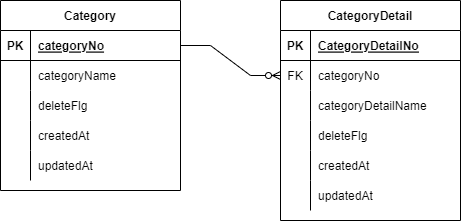
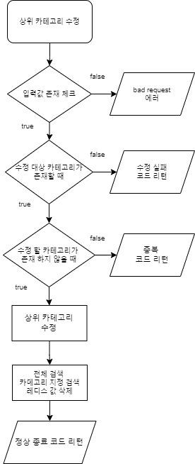
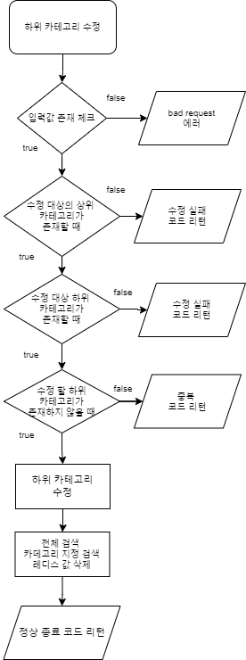
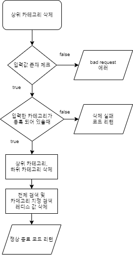

# 개발 환경

    * Java 11
    * Spring boot
    * Jpa
    * h2
    * redis

---

# linux환경에 설정하기 위해 필요한 것

    * 자바 11, gradle 이 설치 되어 있을것

    * java
        install
            yum install java-11-openjdk-devel.x86_64
        java -version, javac -version 으로 버전 확인

        java 환경변수 설정
            readlink -f /bin/javac 명령어로 자바가 설치된 경로 확인
            /etc/profile 파일에 환경 변수 설정 (vi 이용시 vi /etc/profile)
            하단에 아래와 같이 추가
                export JAVA_HOME=자바가 설치된 경로
                ☆경로 끝단에 있는 /bin/javac 는 제외
                예) 설치된 경로 /usr/lib/jvm/java-11-openjdk-11.0.11.0.9-1.el7_9.x86_64/bin/javac
                    환경변수에 설정할 경로 /usr/lib/jvm/java-11-openjdk-11.0.11.0.9-1.el7_9.x86_64
            환경변수 적용
                source /etc/profile
            환경변수 적용 결과 확인
                echo $JAVA_HOME

    * gradle
        install
            wget를 이용하여 설치
                yum install wget
            완료 후 gradle.zip 가져오기
                wget https://services.gradle.org/distributions/gradle-7.0.2-bin.zip
            mkdir /opt/gradle 로 gradle압축 풀 폴더 생성
            압축 푼 파일 /opt/gradle로 이동
                unzip -d /opt/gradle gradle-7.0.2-bin.zip
                ☆unzip이 없을시 yum install unzip 로 unzip설치
            cd /opt/gradle/gradle-7.0.2 로 이동하여 설치된 파일 확인
            아래와 같은 파일들이 있으면 설치 완료
                bin
                init.d
                lib
                LICENSE
                NOTICE
                README

        gradle 환경변수 설정
            vi /etc/profile.d/gradle.sh 로 스크립트 생성 후 아래의 내용 입력
                # etc/profile.d/gradle.sh
                export GRADLE_HOME=/opt/gradle/gradle-7.0.2
                export PATH=${GRADLE_HOME}/bin:${PATH}
            아래 명령어로 스크립트 실행 가능하도록 설정
                chmod +x /etc/profile.d/gradle.sh
            환경변수 적용
                source /etc/profile.d/gradle.sh
            gradle 설치 결과 확인
                gradle -v

    * git
        install
            yum install git
        사용자 추가
            git config --global user.name "사용자이름"
            git config --global user.email "사용자 메일"
        이름과 메일 설정되었는지 확인
            git config -l
        소스 내려받을 경로로 이동 후 아래 명령어로 소스 내려받기
            git clone https://github.com/Moonbyeonggeun/categoryApi.git

    * redis
        install
            sudo apt-get install redis-server
        redis 실행
            systemctl start redis
        ☆현재 소스상 포트가 6379로 설정 되어 있으나 이미 사용중인 경우 소스 수정 필요
            수정해야할 파일과 내용
            ~/categoryApi/src/main/resources
            spring.redis.port= 사용할 포트

    * build
        소스가 있는 폴더(~/categoryApi)에서 빌드
            ./gradlew build
            ☆Permission denied 에러가 발생하면 아래의 명령어로 권한 부여
                chmod +x gradlew
        정상적으로 종료되면 ~/categoryApi/build/libs 경로에 CategoryApi-0.0.1-SNAPSHOT.jar 가 생성된것 확인
        아래 명령어로 실행
            java -jar CategoryApi-0.0.1-SNAPSHOT.jar

        ☆현재 소스상 포트가 6379로 설정 되어 있으나 이미 사용중인 경우 소스 수정 필요
            수정해야할 파일과 내용
            ~/categoryApi/src/main/resources
            server.port= 사용할 포트

---
# 테이블 구조

---

# 기능별 플로우 차트
* 카테고리 등록
\

* 하위 카테고리 등록
\

* 카테고리 수정
\

* 하위 카테고리 수정
\

* 카테고리 삭제
\

* 하위 카테고리 삭제
\

* 카테고리 검색
\

--- 

# 기능 구현 상세 내용

    * 등록 처리
        기존 중복 데이터가 있는지 체크 후 insert
        중복 데이터가 있는 경우 중복 코드 리턴
        검색시 redis에서 조회할 경우 조회가 안되기 때문에 redis 초기화

    * 수정 처리
        수정 대상 카테고리의 존재 체크 및 수정 될 카테고리의 존재 체크 후 upsert(jpa의 save)
        수정 대상 카테고리가 존재하지 않는 경우 실패 코드 리턴
        수정 될 카테고리가 존재 하는 경우 중복 코드 리턴
        상위 카테고리가 수정되는 경우 그에 해당하는 하위 카테고리의 상위 카테고리도 함께 수정됨
        검색시 redis에서 조회할 경우 조회가 안되기 때문에 redis 초기화

    * 삭제 처리
        수정 대상 카테고리의 존재 체크 후 삭제 처리
        데이터는 물리 삭제 하지 않고 논리 삭제
            삭제된 데이터가 등록 될 경우 삭제 플래그가 설정된 데이터를 update하여 사용
        검색시 redis에서 조회할 경우 조회가 안되기 때문에 redis 초기화

    * 검색 처리
        검색 조건이 있는 경우 상위 카테고리 지정 검색
        검색 조건이 없는 경우 전체 검색
        모든 검색에는 각 상위 카테고리에 해당하는 하위 카테고리도 전체 검색
        DB조회 전 redis를 먼저 조회 하여 값이 있는 경우 redis에서 조회한 데이터 리턴
            ☆현재 소스상 redis expire time이 1분으로 되어 있음.
        redis에 데이터가 없는 경우 DB 직접 조회
        redis키 값은 전체 검색의 경우 `searchCategory_all`, 카테고리를 지정하여 검색하는 경우 입력값을 unicode로 변환하여 searchCategory_유니코드로 변환한 값  으로 설정

---
# 테스트 방법

    * 스웨거 페이지로 접속하여 테스트 
        http://빌드한 서버 ip:설정한 포트번호/swagger-ui/#/

    1. 상위 카테고리 등록 [/api/category/insertCategory]
        * 상위 카테고리를 등록
        * 중복으로 등록할 경우 등록 실패
        * 삭제된 카테고리 재등록 가능

    2. 하위 카테고리 등록 [/api/category/insertCategoryDetail]
        * 존재하는 상위 카테고리를 지정하여 하위 카테고리 등록 가능
        * 존재하지 않는 상위 카테고리를 지정하여 등록할 경우 등록 실패
        * 하위 카테고리를 중복으로 등록할 경우 등록 실패

    3. 상위 카테고리 수정 [/api/category/updateCategory]
        * 상위 카테고리를 수정
        * 존재하지 않는 상위 카테고리를 지정할 경우 수정 실패
        * 이미 존재하는 상위 카테고리로 수정할 경우 수정 실패

    4. 하위 카테고리 수정 [/api/category/updateCategoryDetail]
        * 상위 카테고리를 지정하여 하위 카테고리 수정
        * 존재하지 않는 상위 카테고리 또는 하위 카테고리를 지정할 경우 수정 실패
        * 이미 존재하는 하위 카테고리로 수정할 경우 수정 실패

    5. 상위 카테고리 삭제 [/api/category/deleteCategory]
        * 상위 카테고리 삭제
        * 존재하지 않는 상위 카테고리를 지정할 경우 삭제 실패

    6. 하위 카테고리 삭제 [/api/category/deleteCategoryDetail]
        * 상위 카테고리를 지정하여 하위 카테고리 삭제
        * 존재하지 않는 상위 카테고리 또는 하위 카테고리를 지정할 경우 삭제 실패

    7. 카테고리 검색 [/api/category/searchCategory]
        * 상위 카테고리를 지정하여 검색 하는 경우 해당 상위 카테고리의 하위 카테고리까지 검색
        * 상위 카테고리를 지정하지 않는 경우 존재하는 모든 카테고리 검색
